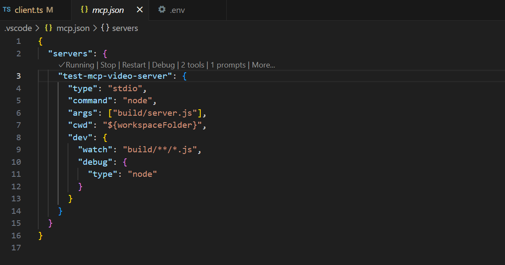
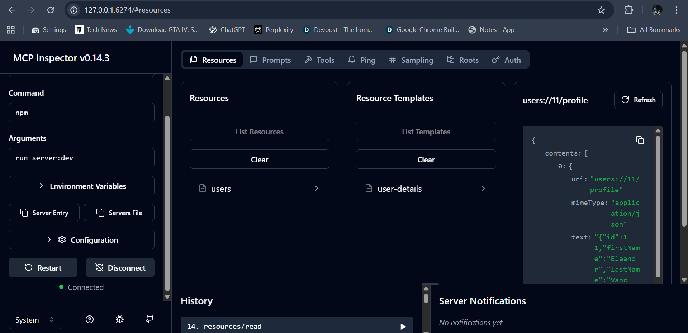
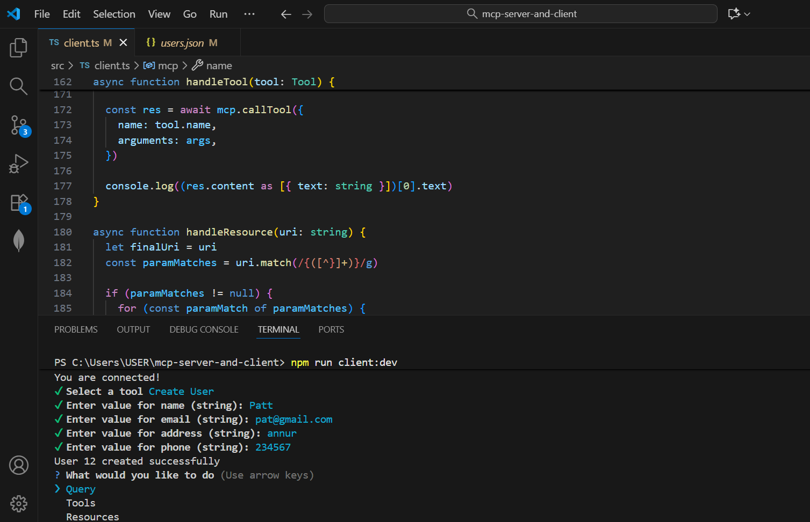
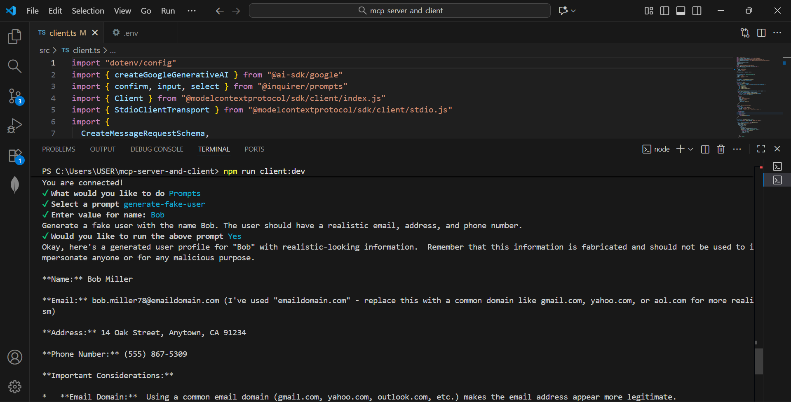
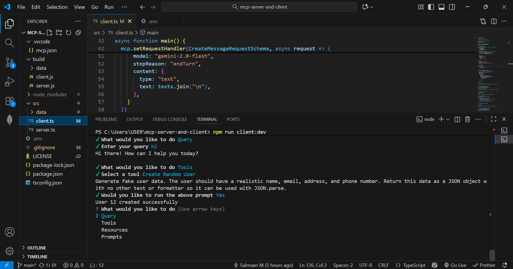

# MCP Server and Client

This project is a hands-on implementation of the Model Context Protocol (MCP), featuring both MCP server and client applications developed in TypeScript.

## Features

- Full MCP protocol implementation with both server and client logic.
- Create, query, and manipulate user data using custom tools and resources.
- Integrated JSON data management and user prompt interactions.
- Inspector UI for real-time resource and tool inspection.

## Screenshots

Below are some key screenshots illustrating how the project works in practice:

  
  Configuration setup for MCP servers and runtime options.
  
  
  Graphical interface for inspecting resources, tools, and prompts within the MCP server.
   
  
  Steps to view and select available automation tools and actions.
  
  
  Demonstration of custom prompts and how they help generate user or test data.
  
  
  Example of integrating Gemini and processing responses within the tool.
  Can be used for samplings which helps in prompting.

1. Clone this repository and install dependencies with:

   ```bash
   git clone <your-repo-url>
   cd mcp-server-and-client
   npm install
   ```

2. Build the TypeScript project:

   ```bash
   npm run build
   ```

3. Start the server and client as shown in the tutorial:

   ```bash
   npm run server:dev
   npm run client:dev
   ```

4. Use the MCP Inspector for advanced interactions and visualization.

## Usage

- Run server/client scripts and interact with the terminal or Inspector UI.
- Follow prompts to create and manage fake user data.
- Explore available MCP tools, resources, and prompts.

## Technologies Used

- TypeScript
- Node.js
- MCP (Model Context Protocol) SDK
- Inquirer.js for CLI prompts
- Zod for validation

Here is a README script you can use to add references to the Model Context Protocol (MCP) SDK GitHub and official specification. This passage is formatted for Markdown and credits the protocol while guiding users to deeper documentation:

***

## Model Context Protocol Reference

For advanced usage, standards, and protocol details, this project is built on top of the official Model Context Protocol (MCP):

- [MCP TypeScript SDK on GitHub](https://github.com/modelcontextprotocol/typescript-sdk?tab=readme-ov-file)  
  The core library powering this project, enabling the creation of robust MCP servers and clients in TypeScript.  
  → Contains installation instructions, quick start guides, and a full example set.

- [MCP Official Protocol Specification (2025-06-18)](https://modelcontextprotocol.io/specification/2025-06-18)  
  Detailed specification describing the principles and mechanisms used in MCP for context sharing, tool integration, resource management, and security.  
  → Recommended for understanding server/client negotiation, tool/resources/prompts definitions, and best practices for secure and privacy-respecting implementations.

These resources offer guidance and technical standards required to extend or integrate with the MCP ecosystem. Be sure to follow their recommendations for consent, security, privacy, and safe tool execution when building and maintaining MCP applications.
